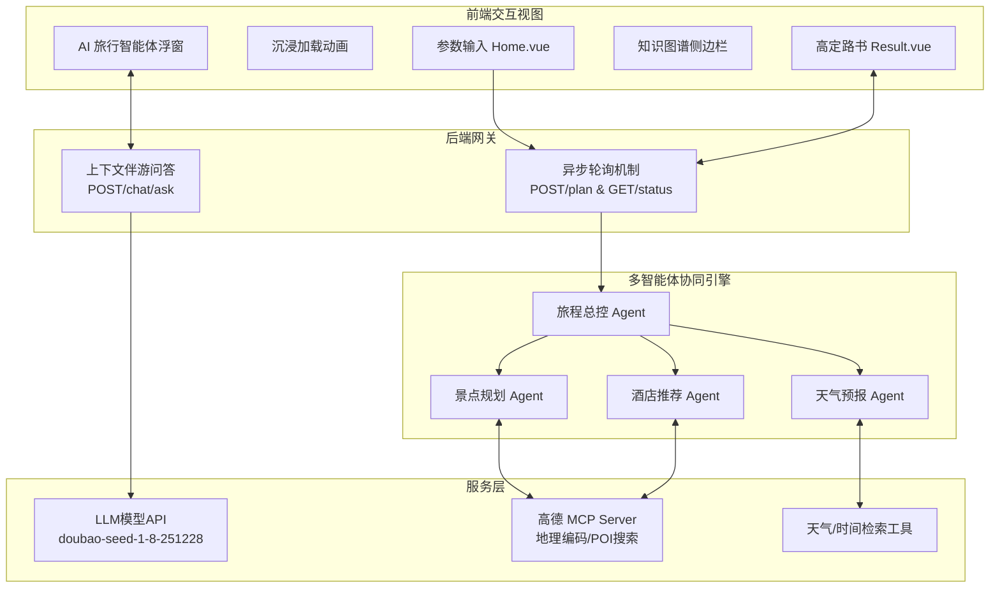

# 旅途星辰 (TripStar) - AI 旅行智能体

> **基于 HelloAgents 框架打造的多智能体协作文旅规划平台**

<p align="center">
  
  
  
  
  
  
</p>

> [!IMPORTANT]
> 
> 可直接体验项目，为避免拥挤可自行部署：[旅途星辰 (TripStar) - AI 旅行智能体](https://modelscope.cn/studios/lcclxy/Journey-to-the-China)
> 
> 其中包括：旅行计划、景点地图概览、预算明细、每日行程：行程描述、交通方式、住宿推荐、景点安排（地址、游览时长、景点描述）、餐饮安排、天气信息、知识图谱可视化、沉浸式伴游 AI 问答......

## 项目简介

**旅途星辰 (TripStar)** 是一个创新的 AI 文旅智能体应用，基于 HelloAgents 框架打造的多智能体协作文旅规划平台，旨在解决用户在规划旅行时面临的“信息过载”和“决策疲劳”问题。

有别于传统的旅游攻略网站，本项目采用了基于 **大语言模型 (LLM)** 和 **多智能体 (Multi-Agent)** 协作架构的创新模式。它能像一位经验丰富的人类旅行管家一样，全面考虑用户的个性化需求（偏好设置：交通方式、住宿风格、旅行兴趣、特殊需求等），自动搜索旅行信息、查询当地天气、精选酒店并规划最优景点路线，以**快速完成旅游攻略**。

### 核心亮点

* **多语言支持**: 深度集成 Vue I18n，系统界面及 AI 问答全程支持多语言无缝切换，为全球旅行者打造无障碍的行程规划体验。
* **高定主题互动地图**: 深度集成高德地图 JS API 2.0，动态绘制“起点-景点-终点”的真实经纬度打卡路线，提供高级定制底图配色，一眼预览景点位置方便安排行程。
* **精准预算明细面板**: 智能汇总门票、餐饮、住宿与交通等多维度花销账单，提供直观的财务面板报表，让出行预算尽在掌握。
* **多智能体协作协同**: 采用分工明确的多个 Agent（如景点规划师、天气预报员、酒店推荐专家），通过工作流 (Workflow) 协同完成复杂的旅行规划任务。
* **知识图谱可视化**: 将生成的行程数据实时转换为节点关系图，直观展示“城市-天数-行程节点-预算”的空间结构。
* **沉浸式伴游 AI 问答**: 在生成报告后，提供悬浮式 AI 问答窗口（左下角），AI 拥有完整行程的上下文记忆，用户可随时针对行程细节（如票价、适宜性）进行追问。
* **奢华暗黑玻璃拟物风**: 全新设计的暗黑系玻璃拟物化 (Dark Luxury Glassmorphism) 界面，提供极具沉浸感的高级视觉体验。
---
> 举个例子要去中国——洛阳（目前只支持国内）玩耍，只需要填写地点、日期、偏好设置，即可等待行程规划的结果，一眼预览如何安排旅游景点


## 系统架构

本项目采用标准的前后端分离架构，分为前端 Vue 交互层、后端 FastAPI 服务层和 LLM/Agents 的智能推理层。



---

## 核心功能与工作流

### 1. 异步轮询任务系统 (解决网关超时)

针对 LLM 生成超长文本易导致 504 Gateway Timeout 的痛点，重构了后端的任务调度机制。

* **`POST /api/trip/plan`**: 立即返回 `task_id`，将长达数分钟的推理任务推入后台 `asyncio.create_task`。
* **`GET /api/trip/status/{task_id}`**: 前端每 3 秒发起一次轻量请求，实时获取当前处理进度（如"🔍 正在搜索景点..."），直至状态变为 `completed`。

### 2. 多智能体架构 (Agentic Workflow)

主控 Agent 接收到用户自然语言指令后，基于 React 模式拆解任务：

1. **并发启动**: 景点规划师调用地图工具寻找适宜 POI；天气管家查询目标日期的气候状况；机酒专员根据预算寻找合适落脚点。
2. **路线编排**: 主控 Agent 收集三方数据，进行统筹优化，计算两两景点间的距离和最优游玩顺序，避免行程折返跑。
3. **结果聚合**: 最终输出包含预算明细、逐日行程、防坑指南等详细参数的结构化 JSON。

### 3. 数据驱动的动态组件渲染

前端不再是写死的静态展示，而是通过响应式变量读取 JSON 数据：

* **高德地图 JS API 2.0 组件**: 动态读取 POI 经纬度，绘制连线与标记。
* **ECharts 知识图谱组件**: 将树状的旅行层级转化为关系网络（图数据库雏形）。

---

## 快速部署与运行指北

### 环境准备

* Python 3.10+
* Node.js 18+
* 大模型 API Key（推荐使用兼容 OpenAI 格式的服务商，如豆包、阿里云百炼）
* 高德地图两种key： Web服务 、 Web端(JS API) (其**安全密钥 JSCode**配置在index.html中)（[高德api](https://lbs.amap.com/)）
* 图片抓取api（[Unsplash API](https://unsplash.com/developers)）
* 安装 `uv` 包管理器

### 1. 后端启动

```bash
# 进入后端主目录
cd backend

# 创建虚拟环境
python -m venv venv

# 激活虚拟环境
source venv/bin/activate  # Windows: venv\Scripts\activate

# 安装项目依赖包
pip install -r requirements.txt

# 复制配置文件并填入相应的 API KEY
cp .env.example .env
# [必填] LLM_API_KEY, LLM_BASE_URL, LLM_MODEL_ID（选择有结构化输出能力的模型）
# [必填] VITE_AMAP_WEB_KEY (高德地图 web服务 类型的key)
# [必填] Unsplash API Credentials（创建应用后的key）

# 启动 FastAPI (推荐通过 uvicorn)
uvicorn app.api.main:app --host 0.0.0.0 --port 8000 --reload
```

API 启动后，您可以访问 `http://localhost:8000/docs` 查看互动文档。

### 2. 前端启动

```bash
# 进入前端主目录
cd frontend

# 使用 npm (或 pnpm/yarn) 安装依赖
npm install

# 配置前端环境变量，创建 .env 文件
# [必填] VITE_AMAP_WEB_KEY 与后端保持一致
# [必填] VITE_AMAP_WEB_JS_KEY 必须是 Web端(JS API) 类型的key
# 另外，由于 JS API 2.0 政策要求，**还需要在 index.html 注入你的安全密钥(securityJsCode)**

# 启动 Vite 开发服务器
npm run dev
```


---

## 目录结构与关键代码导读

```text
helloagents-trip-planner-new/
├── backend/                       # Python FastAPI 后端
│   ├── app/
│   │   ├── api/routes/            # 核心路由 (trip.py, chat.py)
│   │   ├── agents/                # 多智能体定义与编排 (trip_planner_agent.py 并发核心)
│   │   ├── services/              # 业务逻辑封装 (包括 amap_service MCP调用逻辑)
│   │   └── models/                # Pydantic 类型定义
│   └── .env                       # LLM 及系统环境变量载体
│
├── frontend/                      # Vue 3 互动前端
│   ├── src/
│   │   ├── views/                 # 主路由视图 (Home.vue 表单输入; Result.vue 路书展示)
│   │   ├── components/            # 独立复用的 UI / 背景组件
│   │   └── services/              # Axois 异步轮询及配置重试逻辑 (api.ts)
│   ├── index.html                 # 入口挂载及高德地图 SecurityKey 预设
│   └── package.json
│
├── Dockerfile                     # 通用生产发布容器脚本
└── README.md
```

> 下面是部分运行结果，丰富的功能探索中...


## 后续可扩展方向

1. **配置goole地图服务**: 当前依赖高德地图的mcp服务，为达到全球使用的效果，后续转为goole相关服务。
2. **小红书mcp的适配**: 针对景点的相关推荐，计划调用小红书mcp进行搜索，完善景点推荐流。
3. **计划导入功能**: 针对生成计划导出功能添加json，并添加计划导入模块，方便查看之前生成的计划并进行修改。

## 🙏 致谢
感谢 [linuxdo](https://linux.do/) 社区的交流、分享与反馈，让 TripStar 的迭代更高效。
